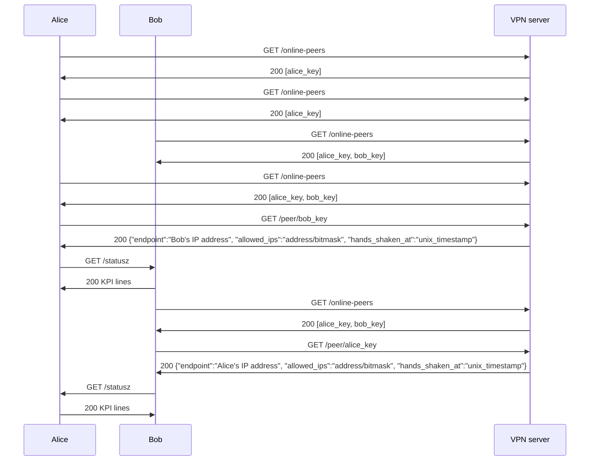

# Ideal case

```mermaid
sequenceDiagram
    participant A as Alice
    participant B as Bob
    participant S as VPN server
    
    A->>S: GET /online-peers
    S->>A: 200 [alice_key]
    A->>S: GET /online-peers
    S->>A: 200 [alice_key]
    B->>S: GET /online-peers
    S->>B: 200 [alice_key, bob_key]
    
    A->>S: GET /online-peers
    S->>A: 200 [alice_key, bob_key]
    A->>S: GET /peer/bob_key
    S->>A: 200 {"endpoint":"Bob's IP address", "allowed_ips":"address/bitmask", "hands_shaken_at":"unix_timestamp"}
    A->>B: GET /statusz
    B->>A: 200 KPI lines
    
    B->>S: GET /online-peers
    S->>B: 200 [alice_key, bob_key]
    B->>S: GET /peer/alice_key
    S->>B: 200 {"endpoint":"Alice's IP address", "allowed_ips":"address/bitmask", "hands_shaken_at":"unix_timestamp"}
    B->>A: GET /statusz
    A->>B: 200 KPI lines
```