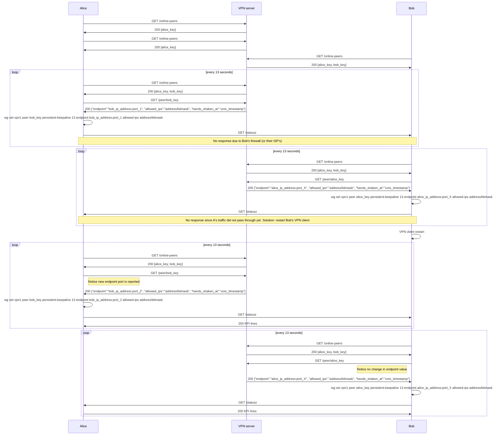

Work in progress

Implementation of https://www.jordanwhited.com/posts/wireguard-endpoint-discovery-nat-traversal using https://redbean.dev

Bob's firewall (or their ISP's) learns addresses only for a few seconds after first Bob's packet is sent. Solution is to restart Bob's VPN client:

# Example Wireguard configuration

Every peer needs unique last component in address (from range 2 to 254, both inclusive). Examples below are **NOT** usable without replacing `<REDACTED>` with correct values!

## Central node

    [Interface]
    Address = 192.168.7.1
    ListenPort = 51820
    PrivateKey = <REDACTED>
    PostUp = /etc/wireguard/redbean.com -d -l 192.168.7.1 192.168.7.1
    PostDown = /usr/bin/pkill -f 'ape.* /etc/wireguard/redbean.com' &

    [Peer]
    PublicKey = paste peer's PUBLIC key here
    AllowedIPs = 192.168.7.5/32

    [Peer]
    ...

## Windows Peer

    [Interface]
    Address = 192.168.7.5
    PrivateKey = <REDACTED>
    # everything below is common for all Windows peers
    PostUp = C:\Windows\System32\redbean.com -d -l 192.168.7.5 192.168.7.1
    PostDown = C:\Windows\System32\redbean.com terminate

    [Peer]
    PublicKey = paste central node's PUBLIC key here
    Endpoint = paste public address or domain name of central node goes here, with :51820 appended
    AllowedIPs = 192.168.7.0/24
    PersistentKeepalive = 13

## Linux Peer

    [Interface]
    Address = 192.168.7.5
    PrivateKey = <REDACTED>
    # everything below is common for all Linux peers
    PostUp = /etc/wireguard/redbean.com -d -l 192.168.7.5 192.168.7.1
    PostDown = /usr/bin/pkill -f 'ape.* /etc/wireguard/redbean.com' || true

    [Peer]
    PublicKey = paste central node's PUBLIC key here
    Endpoint = paste public address or domain name of central node goes here, with :51820 appended
    AllowedIPs = 192.168.7.0/24
    PersistentKeepalive = 13

### TODOs

- test restart condition is correctly detected
- generate config files
- UI
- logs