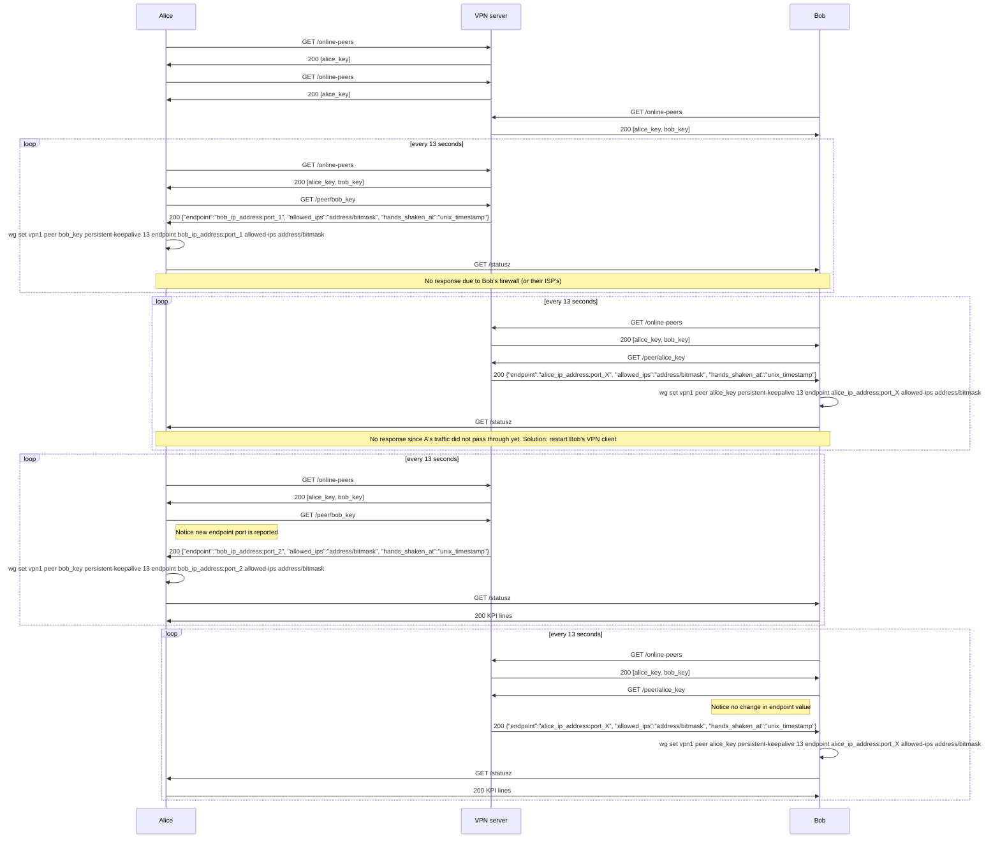

Implementation of https://www.jordanwhited.com/posts/wireguard-endpoint-discovery-nat-traversal

Unfortunately Bob's firewall (or their ISP's) learns addresses only for a few seconds after first Bob's packet is sent. Solution is to restart Bob's VPN client:

